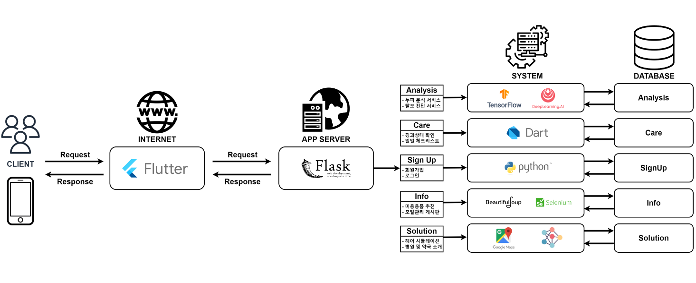

# 탈모 진단 및 관리 서비스

## 프로젝트 소개

**AI Hub에서 제공하는 두피 상태 데이터셋**을 활용하여 사용자가 **탈모를 빠르게 대처**하고 **정확한 정보를 제공받을 수 있도록 지원**하는 서비스를 목표로 합니다.

**두피 분석**, **탈모 진단**, **맞춤 관리**, **정보 제공** 및 **솔루션 추천**을 통해 사용자들에게 최적화된 경험을 제공합니다.

---

## 주요 기능

### 1. 두피 분석 및 탈모 진단
- TensorFlow와 딥러닝 모델을 활용하여 두피 이미지를 분석하고 탈모 상태를 진단합니다.
- 사용자는 두피 상태에 대한 **미세각질, 피지 과다, 탈모 진행 상태** 등을 포함한 진단 결과를 확인할 수 있습니다.

### 2. 맞춤형 관리
- 진단 결과를 기반으로 **일일 체크리스트**와 **복용 약 정보**를 제공하여 탈모 관리를 지원합니다.
- 사용자의 현재 상태를 지속적으로 추적하고 개선 사항을 모니터링합니다.

### 3. 커뮤니티와 정보 제공
- **게시판**을 통해 사용자 간의 경험 공유 및 유용한 정보를 교환할 수 있습니다.
- Selenium과 BeautifulSoup을 활용하여 **미용용품 추천** 및 **모발 관리 관련 최신 정보**를 수집해 제공합니다.

### 4. 솔루션 추천
- Google Maps API를 활용하여 주변 병원 및 약국 정보를 제공합니다.
- 사용자의 상태에 따라 최적의 병원 및 치료 솔루션을 추천합니다.

---

## 시스템 아키텍처

---

## 데이터셋 정보

- **데이터 출처**: AI Hub
- **데이터 규모**: 101,027건의 증상별 두피 이미지
- **증상 분류**:
    - 비듬, 미세각질, 피지 과다, 탈모
    - 모낭홍반농포, 모낭사이홍반
